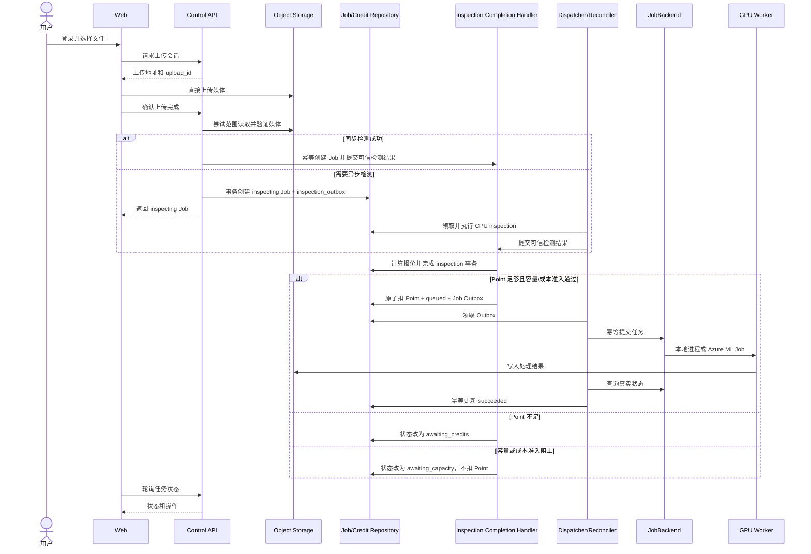
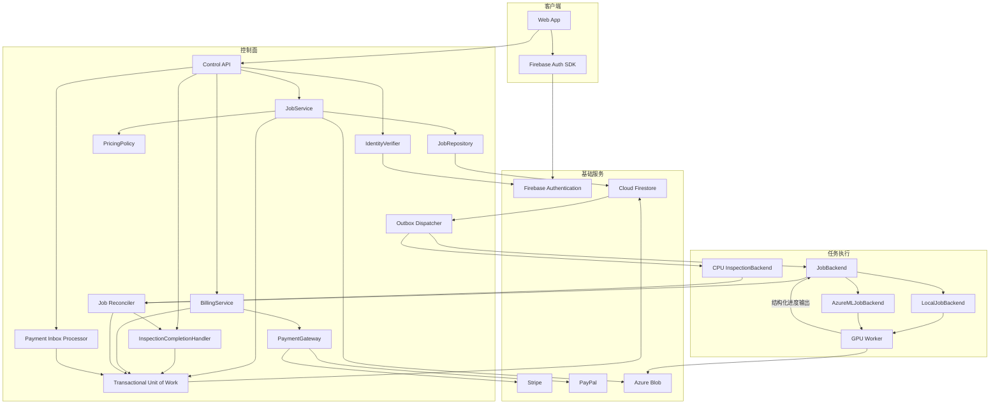
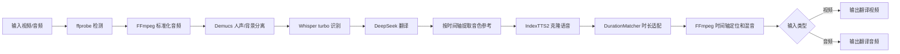
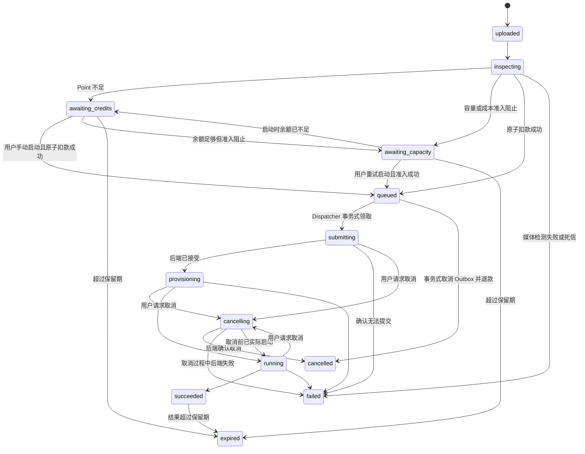
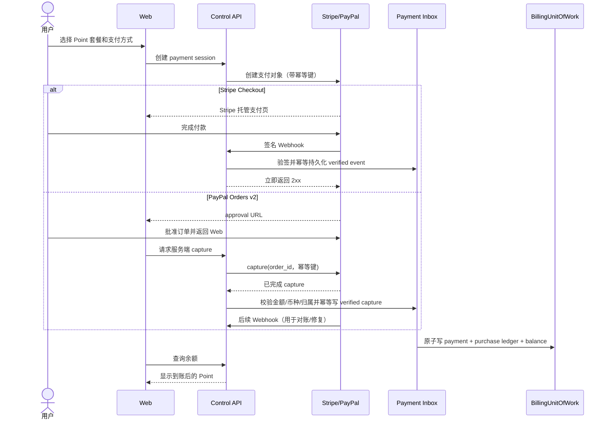

# VideoTranslator 2.0 产品、技术架构与实施方案

> 2026-09-23 部署方案更新：当前稳定版本迁移 Azure 的实施入口为 [日本 T4 改造方案](AZURE_JAPAN_T4_MIGRATION_PLAN.md)，资源实况见 [创建与验证记录](AZURE_JAPAN_RESOURCES.md)。本文保留产品设计历史；其中 Azure ML 部署路径、转写默认值、计费示例和待确认清单不能代替当前运行配置及已实现业务规则。

> 状态：已确认技术设计基线
> 版本：0.5
> 日期：2026-07-22
> 目标：以一套可本地运行、可部署 Azure、可扩展云厂商与第三方服务的系统，完整替代当前脚本式项目。

---

## 1. 执行摘要

VideoTranslator 2.0 是一个面向最终用户的长耗时媒体翻译系统。用户登录后上传一个视频或音频，系统根据媒体时长计算 Point 消耗；创建任务时余额足够且容量/成本准入通过，才立即扣除 Point 并排队处理。余额不足则提示充值，容量不足则保留任务并提示稍后重试；两者都不扣 Point。充值只增加 Point，不自动启动或消费任何历史任务；用户充值后需要回到任务列表手动点击“启动”。任务完成后，用户可以在“我的任务”中下载结果。

系统采用控制面与数据面分离的架构：

- **控制面**负责登录、用户、任务记录、Point、支付、授权、排队提交和结果下载。
- **数据面**是无状态 GPU Worker，一次只处理一个已经授权并扣费的任务。
- **JobBackend** 抽象本地队列与 Azure ML Job，使同一套网页和 API 可以在本机与云端运行。
- **处理模块**通过接口隔离 Whisper、DeepSeek、Demucs、IndexTTS2、FFmpeg 和存储实现，后续可以按同等能力替换。

当前暂定业务规则：

- `1 USD = 1 Point`。
- `1 Point = 1 分钟`视频或音频翻译。
- 文件允许先上传；余额不足时不进入处理队列。
- 余额足够时，扣 Point 和进入队列必须是同一个原子操作。
- 充值和启动是两个独立操作；充值到账后不自动启动任何任务。
- 第一版单个媒体最长 30 分钟，每个用户最多有 1 个已扣款的活动任务，全系统 GPU 并发为 1。
- 容量或应用成本护栏阻止启动时不扣 Point，用户稍后手动重试启动。
- 排队期间取消或系统失败，默认全额退 Point。
- 以上价格、充值档位、保留期限和退款规则均为可配置策略，不写死在核心代码中。

---

## 2. 项目目标

### 2.1 产品目标

1. 用户可以通过 Google 或邮箱注册、登录和找回密码。
2. 用户只需上传一个视频或音频、选择目标语言，然后等待处理完成。
3. 系统忽略输入中的字幕，始终从音轨执行语音识别。
4. 用户可以查看自己的历史任务、当前状态、预计消耗和结果。
5. 用户可以通过 Stripe 或 PayPal 购买 Point。
6. 创建任务时 Point 足够且准入通过则自动启动；余额不足时显示“充值”，容量/成本受限时显示“稍后重试”，两者都由用户后续手动点击“启动”。
7. 云端任务自动排队，空闲时不保留付费 GPU。
8. 同一套系统支持本地开发、本地真实 GPU 测试和 Azure 生产部署。
9. 核心处理服务可以替换，不让业务层直接依赖具体厂商。

### 2.2 工程目标

1. 删除当前单文件 8 步编排和大量交叉条件。
2. 建立稳定的数据契约、状态机和模块接口。
3. 一个核心 Worker 同时服务 LocalJobBackend 与 AzureMLJobBackend。
4. 所有余额变化可审计、可重放、不可静默覆盖。
5. 所有支付 Webhook、任务提交和退款操作具备幂等性。
6. 容器镜像版本固定、可复现，并发布到 GHCR。
7. 具备单元测试、集成测试、短媒体 GPU 验收和云端端到端验收。

### 2.3 第一版不做

- 不做实时流式翻译。
- 不做多人协作或组织账号。
- 不做订阅制，只做预付 Point。
- 不做用户之间的 Point 转账或提现。
- 不做字幕上传、字幕编辑或字幕优先模式。
- 不做多个说话人的独立音色管理。
- 不做同时运行多张 GPU；第一版并发上限为 1。
- 不做跨说话人片段合并或允许语音时间轴持续漂移。
- 不做复杂管理后台，只保留必要的人工调整和审计能力。

---

## 3. 用户体验与业务流程

### 3.1 页面范围

第一版前端保持四个简单区域：

1. **登录/注册**
   - Google 登录。
   - 邮箱注册与登录。
   - 邮箱验证。
   - 忘记密码。

2. **上传与创建任务**
   - 上传一个视频或音频。
   - 选择目标语言。
   - 显示检测到的时长和预计 Point。
   - 显示当前余额。

3. **我的任务**
   - 文件名、时长、消耗、状态、创建时间、操作。
   - 等待充值时显示“充值”；余额足够后显示“启动”。
   - 排队时允许取消。
   - 完成时显示下载。
   - 系统繁忙时显示“稍后重试启动”。
   - 失败时显示简洁原因；符合条件且输入仍保留时显示“重试”。

4. **充值弹窗/页面**
   - 选择 Point 档位。
   - 选择 Stripe 或 PayPal。
   - 支付后返回任务页面。

### 3.2 正常提交



### 3.2.1 Inspection 完成处理

`InspectionCompletionHandler` 是同步和异步媒体检测的唯一完成入口：

1. 同步范围读取成功时，由 `/uploads/{upload_id}/complete` 直接调用。
2. 需要 CPU inspection worker 时，complete 只返回 `inspecting` Job；Inspection Dispatcher 执行检测，Inspection Reconciler 发现检测终态后调用同一个 Handler。
3. Handler 使用 upload session 中预留的稳定 `job_id` 幂等创建 Job，或验证已有 Job 仍为 `inspecting` 且检测结果属于当前 `inspection_attempt`，然后计算可信时长和报价。
4. 余额足够且容量/成本准入通过时，Handler 通过 JobFundingUnitOfWork 在一个事务中写媒体信息、报价、成本预算预留、`job_charge`、余额、`queued` 和 `job_outbox`。
5. 余额不足时，同一事务写媒体信息、报价并改为 `awaiting_credits`，不扣款、不写 Job Outbox。
6. 余额足够但容量或成本准入阻止时改为 `awaiting_capacity`，不扣款、不写 Job Outbox；用户稍后手动重试启动。
7. 检测失败时改为 `failed`，记录稳定错误码，不扣 Point。

Handler 使用 `inspection-complete:<job_id>:<inspection_attempt>` 作为幂等键。同步 complete、CPU worker 重试和 Reconciler 重复观察到成功时，都只能完成一次状态转换和首次扣款。

### 3.3 余额不足

1. 文件正常上传。
2. 服务端检测真实媒体时长。
3. 创建 `awaiting_credits` 任务，但不提交 JobBackend。
4. 页面显示缺少多少 Point 和“充值”。
5. 用户选择充值档位和支付平台。
6. 支付平台 Webhook 确认到账后增加 Point。
7. 充值流程到此结束，不自动选择、扣款或启动任何任务。
8. 用户回到任务列表，手动点击“启动”。
9. 后端重新读取余额、任务状态、容量和成本预算；全部满足时原子扣 Point、预留成本预算、写入提交 Outbox，并将任务改为 `queued`。

### 3.4 下载

1. 用户请求下载某任务结果。
2. API 验证 Firebase ID Token。
3. API 验证 `job.owner_user_id == current_user.uid`。
4. API 确认任务为 `succeeded` 且结果仍在保留期内。
5. API 返回短时有效的 Azure Blob SAS URL 或本地受控下载地址。
6. Blob 永远不公开，Worker 也不生成永久公开链接。

### 3.5 失败后重试

符合条件的系统失败不要求重新上传媒体。用户点击“重试”时，系统创建一个新 Job，并引用仍在保留期内的同一个输入对象：

```text
new_job.retry_of_job_id = failed_job.job_id
new_job.attempt_number = failed_job.attempt_number + 1
new_job.input_object_key = failed_job.input_object_key
```

终态 Job 不从 `failed` 退回 `queued`，以免覆盖历史、退款和错误审计。重试规则：

- 仅 `retry_allowed=true`、输入仍存在、账号可用的失败任务显示“重试”。
- Azure/网络临时故障、Worker 非确定性故障和已修复的系统错误可以重试；损坏媒体、无音轨、格式不支持、授权问题等确定性错误默认禁止重试。
- 原失败尝试如果已经退款，新执行必须重新执行余额、容量和成本准入，并产生新的 `job_charge`；成功后最终净消费一次，不能无限免费消耗 GPU。
- 新 Job 在 72 小时重试窗口内沿用原 `quoted_point_units` 和 `pricing_version`，避免系统故障后价格变化；超过窗口必须重新检测和报价。
- 同一输入链上最多允许 `max_retry_attempts` 次重试（v1 默认 3，可配置）；`attempt_number` 超过上限后源 Job 的 `retry_allowed` 置为 `false`，防止持续系统故障下无限免费消耗 GPU。
- 输入对象由多个 Job 引用时采用引用计数或存活引用检查，任何一个可重试 Job 仍依赖该对象时不得清理。
- 平台需要免费补偿时，通过单独的 `promotion` 或 `admin_adjustment` Ledger Entry 发放 Point，不改变重试扣款规则。

---

## 4. 暂定业务规则

### 4.1 Point 内部单位

禁止使用浮点数存储余额。

```text
1 Point = 100 Point Units
```

展示时：

```text
display_points = point_units / 100
```

### 4.2 暂定消耗公式

```text
duration_ms = ceil(Decimal(ffprobe_duration_string) × 1000)
cost_units = ceil(duration_ms × point_units_per_minute ÷ 60000)
```

ffprobe 时长字符串必须先转换为 `Decimal`，不得经过二进制浮点数；随后保守地向上取整为 64 位整数毫秒并作为唯一可审计时长。第一版不先对整秒取整，只在毫秒和最终 Point Units 两个明确边界执行向上取整。例如 60.1 秒存为 `60100` ms，按 `ceil(60100 × 100 ÷ 60000) = 101` Units 计费。对应配置名称固定为 `ceil_final_point_unit`。

示例：

| 时长 | Point Units | 展示 Point |
|---:|---:|---:|
| 30 秒 | 50 | 0.50 |
| 60 秒 | 100 | 1.00 |
| 90 秒 | 150 | 1.50 |
| 10 分钟 | 1000 | 10.00 |

### 4.3 价格版本

价格策略必须版本化：

```text
pricing_version
duration_ms
duration_probe_raw
quoted_point_units
quoted_at
```

价格调整只影响新报价，不重新计算已经上传或排队的任务。

### 4.4 暂定退款规则

| 场景 | 默认处理 |
|---|---|
| 排队期间用户取消 | 全额退 Point |
| 云平台或系统失败 | 全额退 Point |
| Worker 启动前提交失败 | 全额退 Point |
| Worker 已运行后用户主动取消 | 不退 Point |
| 处理成功但用户未下载 | 不退 Point |
| 支付退款或拒付 | 撤销对应 Point；可形成负余额并阻止新任务 |

退款通过新的 Ledger Entry 实现，不修改或删除原扣款记录。

#### 负余额处理

支付退款或拒付通过 `payment_reversal` 扣减 Point，允许物化余额小于零，并将用户 `billing_status` 改为 `hold`。规则如下：

- 后续充值先抵消负余额；只有余额恢复到非负且足以覆盖任务报价时，用户才能手动启动新任务。
- 用户仍可登录、查看历史、下载尚未过期的既有结果和充值，但不能启动新任务。
- 已经完成原子扣款并处于 `queued`、`submitting`、`provisioning` 或 `running` 的任务不因后来出现负余额而自动取消，避免账务事件反向破坏任务状态机；这些任务按照原扣款记录继续处理。
- `billing_status` 在余额恢复到非负且不存在其他支付风险标记时自动回到 `clear`。涉嫌滥用时管理员可以独立将账号 `status` 设为 `suspended`。
- 第一版不在应用内进行债务追讨；拒付申诉和追偿按支付平台流程及服务条款处理。

### 4.5 暂定保留规则

为防止免费存储滥用，第一版建议：

- `awaiting_credits` 输入文件保留 72 小时。
- `awaiting_capacity` 输入文件保留 72 小时。
- 可重试的系统失败输入从失败时间起至少保留 72 小时。
- 完成结果保留 7 天。
- 每个用户最多保留 3 个未充值任务。
- 文件大小上限通过配置控制；第一版媒体时长硬上限为 `1,800,000 ms`（30 分钟），超限在扣款前拒绝。
- 过期清理后任务状态变成 `expired`，保留任务元数据和账本审计记录。

---

## 5. 总体技术架构



### 5.1 控制面职责

- 验证 Firebase ID Token。
- 建立当前用户上下文。
- 创建上传会话。
- 检测媒体和计算报价。
- 通过 InspectionCompletionHandler 统一完成同步或异步检测，并决定首次扣款排队或等待充值。
- 创建与查询任务。
- 原子扣 Point、退款和账本记录。
- 创建 Stripe/PayPal 支付会话。
- 验证和幂等处理支付 Webhook。
- 事务式写入 Outbox，并由 Dispatcher 调用 JobBackend。
- 通过 Job Reconciler 同步本地或 Azure ML 的真实执行状态。
- 检查任务归属并签发下载链接。

### 5.2 GPU Worker 职责

- 读取一个不可变的 JobSpec。
- 下载或读取输入媒体。
- 执行完整翻译处理。
- 通过 `ProgressReporter` 输出阶段和进度；本地写结构化 stdout，Azure 写任务输出文件。
- 上传最终结果和必要日志。
- 返回成功或结构化失败原因。

GPU Worker 不负责：

- 用户登录。
- 余额判断和扣款。
- 支付。
- 列出任务历史。
- 决定任务是否有权启动。
- 持久化排队。

---

## 6. 核心模块边界

### 6.1 身份接口

```python
class IdentityVerifier(Protocol):
    def verify(self, bearer_token: str) -> UserIdentity: ...
```

实现：

- `FirebaseIdentityVerifier`
- `FirebaseEmulatorIdentityVerifier`
- `FakeIdentityVerifier`
- 未来可增加 `EntraIdentityVerifier`

### 6.2 任务后端接口

```python
class JobBackend(Protocol):
    def submit(self, spec: JobSpec, idempotency_key: str) -> BackendJobRef: ...
    def get_status(self, backend_job_id: str) -> BackendStatus: ...
    def cancel(self, backend_job_id: str) -> CancelResult: ...

class MediaInspectionBackend(Protocol):
    def submit(self, spec: InspectionSpec, idempotency_key: str) -> BackendInspectionRef: ...
    def get_status(self, backend_inspection_id: str) -> InspectionStatus: ...
    def get_result(self, backend_inspection_id: str) -> MediaInspectionResult: ...
```

实现：

- `LocalJobBackend`
- `AzureMLJobBackend`
- `FakeJobBackend`
- `LocalCpuInspectionBackend`
- `ContainerAppsInspectionBackend`
- `FakeMediaInspectionBackend`

### 6.3 存储接口

```python
class ObjectStorage(Protocol):
    def create_upload_url(self, object_key: str, expires_in: int) -> str: ...
    def create_download_url(self, object_key: str, expires_in: int) -> str: ...
    def download(self, object_key: str, destination: Path) -> Path: ...
    def upload(self, source: Path, object_key: str) -> str: ...
    def delete(self, object_key: str) -> None: ...
```

实现：

- `LocalObjectStorage`
- `AzureBlobStorage`
- `FakeObjectStorage`

### 6.4 支付接口

```python
class PaymentGateway(Protocol):
    def create_session(self, request: PaymentSessionRequest) -> PaymentSession: ...
    def capture(self, provider_order_id: str, idempotency_key: str) -> PaymentSnapshot: ...
    def verify_webhook(self, headers: Mapping[str, str], raw_body: bytes) -> PaymentEvent: ...
    def get_payment(self, provider_payment_id: str) -> PaymentSnapshot: ...
    def refund(self, provider_payment_id: str, amount_minor: int) -> RefundResult: ...
```

实现：

- `StripePaymentGateway`
- `PayPalPaymentGateway`
- `FakePaymentGateway`

支付平台只负责真钱支付，不直接修改 Point。`PaymentSession` 明确携带 `confirmation_mode=webhook | server_capture`：Stripe Checkout 使用 Webhook 确认；PayPal Orders v2 使用 approval redirect 后由 Control API 服务端执行 capture。`capture()` 对不需要服务端 capture 的 Provider 返回 `not_supported`，不能在业务层用 Provider 类型分支绕过接口。

### 6.5 Point 账本接口

```python
class CreditLedger(Protocol):
    def get_balance(self, user_id: str) -> int: ...
    def list_entries(self, user_id: str, cursor: str | None) -> LedgerPage: ...

class BillingUnitOfWork(Protocol):
    def apply_verified_payment(self, command: ApplyPayment) -> ApplyPaymentResult: ...
    def reverse_payment(self, command: ReversePayment) -> LedgerEntry: ...

class JobFundingUnitOfWork(Protocol):
    def complete_inspection(self, command: CompleteInspection) -> CompleteInspectionResult: ...
    def fund_and_enqueue(self, command: FundAndEnqueue) -> FundAndEnqueueResult: ...
    def cancel_queued_and_refund(self, command: CancelQueuedJob) -> CancelResult: ...
    def fail_and_refund(self, command: FailJob) -> FailResult: ...
```

实现：

- `FirestoreCreditLedger` / `InMemoryCreditLedger` 用于读取余额和流水。
- `FirestoreBillingUnitOfWork` / `FirestoreJobFundingUnitOfWork` 拥有跨用户余额、Ledger、Job、Payment 和 Outbox 的事务边界。
- 对应的 InMemory 实现用于单元测试。

应用层不得通过多个 Repository 调用拼装扣款、退款或支付入账。上述每个 Unit of Work 方法必须在一个 Firestore Transaction 中完成全部业务写入；方法成功即表示整体成功，失败不得留下部分状态。

### 6.6 价格接口

```python
class TopUpPricingPolicy(Protocol):
    def list_packages(self, currency: str) -> list[TopUpPackage]: ...

class JobPricingPolicy(Protocol):
    def quote(self, duration_ms: int, media_type: MediaType) -> JobQuote: ...

class CostAdmissionPolicy(Protocol):
    def evaluate(self, request: CostAdmissionRequest) -> CostAdmissionDecision: ...
```

`CostAdmissionPolicy` 只决定是否允许一次新的付费执行，以及需要预留多少预计 GPU 秒/成本。准入决策和成本预留由 `JobFundingUnitOfWork` 在扣 Point 的同一事务内重新验证并写入，不能先在 API 进程内检查后再无条件扣款。Azure Cost Management Budget 只提供延迟告警，不能实现这一事务契约。

### 6.7 媒体处理接口

```python
class MediaInspector(Protocol): ...
class SourceSeparator(Protocol): ...
class SpeechTranscriber(Protocol): ...
class TranslationProvider(Protocol): ...
class VoiceCloner(Protocol): ...
class DurationMatcher(Protocol): ...
class AudioRenderer(Protocol): ...
class MediaAssembler(Protocol): ...
class ProgressReporter(Protocol): ...
```

第一版实现映射：

| 接口 | 第一版实现 |
|---|---|
| MediaInspector | FFmpeg/ffprobe |
| SourceSeparator | 本地 Demucs 4.1.0 / htdemucs |
| SpeechTranscriber | 本地 Whisper `turbo` |
| TranslationProvider | DeepSeek `deepseek-v4-flash`，非思考模式 |
| VoiceCloner | 本地 IndexTTS2 |
| DurationMatcher | FFmpeg `atempo`、`apad`、`atrim` + 可选译文压缩重试 |
| AudioRenderer | FFmpeg |
| MediaAssembler | FFmpeg |
| ProgressReporter | 本地结构化 stdout / Azure ML 输出目录中的原子 JSON 文件 |

表中的 DeepSeek `deepseek-v4-flash`、Whisper `turbo`、Demucs `4.1.0 / htdemucs` 和 IndexTTS2 是当前候选标识，不是允许直接硬编码的最终常量。进入 Worker 实现前必须用各项目官方文档/API/模型仓库核实实际可用名称、版本、许可证和 T4 兼容性；通过配置与 `processing_profile` 固定实测版本，并把最终解析出的版本写入 Job 运行清单，避免上游别名变化导致结果不可复现。

---

## 7. Worker 处理流水线



内部仍需要时间轴数据来裁剪、合成和对齐，但不作为用户需要管理的字幕功能。内部数据使用结构化 `TimedSegment`，不以 SRT 文件作为模块之间的主契约；只有调试时才可导出 SRT。

```python
@dataclass(frozen=True)
class TimedSegment:
    index: int
    start_ms: int
    end_ms: int
    source_text: str
    translated_text: str | None
```

### 7.1 DurationMatcher 第一版策略

语音时长适配是核心功能正确性，不属于可以推迟的主观翻译质量评估。每段的基础目标时长固定为：

```text
base_duration_ms = end_ms - start_ms
borrowable_gap_ms = min(max(0, next.start_ms - end_ms), 500, floor(base_duration_ms × 0.20))
available_duration_ms = base_duration_ms + borrowable_gap_ms
required_tempo_ratio = max(1, generated_duration_ms / available_duration_ms)
```

第一版配置：

```text
duration_tolerance_ms = 50
soft_max_tempo = 1.20
hard_max_tempo = 1.35
max_borrow_silence_ms = 500
max_borrow_ratio = 0.20
max_translation_compaction_attempts = 2
```

处理顺序：

1. TranslationProvider 首次翻译时接收 `target_spoken_duration_ms`，提示译文简洁，但不得删除关键信息。
2. VoiceCloner 可以使用模型自身的时长提示，但 DurationMatcher 不信任模型一定精确。
3. 生成后先保守移除首尾静音，再用 ffprobe 获取整数毫秒时长。
4. 若生成语音不超过基础时长，保持自然语速并在末尾补静音到 `base_duration_ms`。
5. 若只超过基础时长但能放入允许借用的后续静音，允许占用该静音；下一片段仍锚定原 `start_ms`，不产生累计漂移。
6. 仍超过 `available_duration_ms` 时，以 `required_tempo_ratio` 判断；不超过 `soft_max_tempo` 则直接做保音调加速到 `available_duration_ms`。
7. 超过软上限时，要求 TranslationProvider 在保持语义的前提下压缩译文并重新 TTS，最多两次。
8. 重试后 `required_tempo_ratio <= hard_max_tempo` 时允许最终加速到 `available_duration_ms`；仍超过硬上限则以 `duration_fit_failed` 结束 Job，并按系统处理失败规则退款。不得裁掉非静音语音，也不得把超长部分推入下一段。
9. 第一版不跨说话人合并片段；相邻同说话人片段也暂不合并，避免改变时间轴和音色归属。

FFmpeg `atempo` 接收的是速度倍率，必须使用：

```text
atempo = generated_duration_ms / available_duration_ms
```

例如 8 秒压到 5 秒应使用 `atempo=1.6`。如果倍率超出单个 `atempo` 支持范围，则拆成多个滤镜链。旧项目 AudioStitcher 曾把 `target/generated` 直接传给 `atempo`，会把超长语音进一步放慢；新实现不得迁移这段换算，DurationMatcher 必须用 5 秒、8 秒等固定样例做单元测试。

最终每段输出记录 `generated_duration_ms`、`final_duration_ms`、`borrowed_gap_ms`、`required_tempo_ratio`、实际应用的 `atempo`、译文压缩次数和警告；这些数据用于人工质量检查和后续调参，但不暴露内部字幕编辑功能。

### 7.2 Worker JobSpec

```json
{
  "schema_version": 2,
  "job_id": "job_...",
  "attempt_number": 1,
  "input_uri": "az://media/users/<uid>/jobs/<job_id>/input.mp4",
  "output_uri": "az://media/users/<uid>/jobs/<job_id>/result.mp4",
  "duration_ms": 615200,
  "target_language": "English",
  "source_language": null,
  "processing_profile": "default-v1",
  "duration_policy_version": "duration-v1",
  "max_runtime_seconds": 3361
}
```

JobSpec 不包含用户密码、Firebase Token、Stripe/PayPal 密钥或余额信息。

`target_language`、`duration_ms`、`processing_profile`、时长策略和运行时上限在扣款进入 `queued` 的事务中冻结。Worker 只读取该不可变快照，不能在运行中重新读取用户后来修改的 Job 字段。

第一版不做说话人识别和多说话人身份连续性管理。每个时间段只能从对应输入音频附近选择音色参考；多人对话可以被处理，但不保证跨片段始终为同一个说话人维持相同声线。该限制属于产品已知限制，不改变任务技术状态。

---

## 8. 任务状态机



失败重试是“从一个终态 Job 创建另一个 Job”的跨聚合命令，不是 `failed` 状态的回退箭头。源 Job 永远保持 `failed`；新 Job 复用已验证的媒体元数据和输入引用，在一个创建事务中根据余额/准入结果直接进入 `queued`、`awaiting_credits` 或 `awaiting_capacity`。因此状态机刻意不画 `failed -> queued`。

退款不是任务生命周期状态。Job 保持在 `failed` 或 `cancelled`，并用独立字段表示退款处理：

```text
refund_status = not_applicable | pending | completed | failed
```

这样不会出现同一个任务为了表达账务结果而从 `failed` 变成 `refunded`，也便于前端同时展示“任务失败”和“Point 已退回”。

`expired` 只表示原本可继续操作或下载的业务对象已超过保留期限，因此状态机只画出 `awaiting_credits/awaiting_capacity -> expired` 和 `succeeded -> expired`。`failed`、`cancelled` 的临时输入和输出同样按保留策略清理，但任务状态保持不变，通过 `assets_deleted_at` 和 `asset_cleanup_status` 记录清理结果。处于任何其他非终态的 Job 不允许直接过期；卡死任务必须先由 Watchdog/Reconciler 判定为 `failed` 或 `cancelled`。

### 8.1 对外统一状态

LocalJobBackend 和 AzureMLJobBackend 的原始状态必须映射为：

```text
uploaded
inspecting
awaiting_credits
awaiting_capacity
queued
submitting
provisioning
running
cancelling
succeeded
failed
cancelled
expired
```

前端不读取 Azure ML 原始状态。

### 8.2 前端展示状态归并

API 和数据库保留上面的精确状态，前端只需要展示少量用户可理解的状态：

| 前端状态 | 对应内部状态 |
|---|---|
| 准备中 | `uploaded`、`inspecting` |
| 需要充值 | `awaiting_credits` 且余额不足 |
| 可以启动 | `awaiting_credits` 且当前余额充足 |
| 系统繁忙 | `awaiting_capacity`；显示稍后手动重试，不扣 Point |
| 排队中 | `queued`、`submitting`、`provisioning` |
| 处理中 | `running` |
| 正在取消 | `cancelling` |
| 已完成 | `succeeded` |
| 失败 | `failed` |
| 已取消 | `cancelled` |
| 已过期 | `expired` |

余额变化不会主动改变 `awaiting_credits` Job；“需要充值/可以启动”是 API 根据当前余额和任务报价计算的展示能力。容量恢复也不会自动启动 `awaiting_capacity`。充值或容量恢复后都必须由用户点击启动，系统不得在后台自动消费 Point。

### 8.3 任务提交原子性

有两个合法入口：InspectionCompletionHandler 对首次检测完成的 `inspecting` Job 调用 `complete_inspection()`；用户手动点击启动时，对 `awaiting_credits` 或 `awaiting_capacity` Job 调用 `fund_and_enqueue()`。二者最终都必须在一个 Firestore Transaction 中完成以下操作：

1. 读取账户余额和任务当前状态。
2. 验证任务仍为 `awaiting_credits`、`awaiting_capacity`，或正处于首次创建且允许自动启动的 `inspecting`。
3. 验证余额大于等于报价。
4. 验证用户没有其他已扣款活动任务，并验证媒体时长上限、`capacity_counters/global` 积压计数器和应用成本预算准入。
5. 以当前 Job 配置生成不可变 JobSpec，冻结 `target_language` 和处理策略。
6. 写入成本预算预留和 `job_charge` Ledger Entry。
7. 更新账户余额。
8. 将任务状态改为 `queued` 并生成提交幂等键。

同一个事务还必须写入一条 `job_outbox` 记录。独立 Outbox Dispatcher 根据这条记录调用 JobBackend，并使用稳定的提交幂等键。提交成功后写入 `backend_job_id`；错误分类、重试上限、退避和死信处理统一遵循 §16.1–16.2。这样不会出现“已经扣款，但 API 在提交 Azure ML 前崩溃导致任务永久丢失”的窗口。

### 8.4 Dispatcher 领取与取消竞态

Dispatcher 不得先读取 Outbox、再无条件提交。它必须在 Firestore Transaction 中完成领取：

1. 验证 Job 为 `queued`，Outbox 为 `pending` 且未被取消。
2. 将 Job 改为 `submitting`。
3. 将 Outbox 改为 `processing`，写入 `lease_owner`、`lease_expires_at` 和递增后的 `attempt_count`。
4. 事务成功后才允许调用 JobBackend。

用户取消 `queued` 任务时，同一个事务必须把 Job 改为 `cancelled`、把 Outbox 改为 `cancelled`，并写退款 Ledger Entry。若任务已经是 `submitting`、`provisioning` 或 `running`，API 只能将其改为 `cancelling` 并请求后端取消；必须由 Reconciler 确认后端没有实际启动，才能自动退款。若取消前 Worker 已开始运行，则可以继续执行取消，但按“运行后取消不退款”的规则处理。

Dispatcher 收到提交成功响应时也必须使用事务：若 Job 仍为 `submitting`，保存 `backend_job_id` 并改为 `provisioning`；若 Job 已被并发改为 `cancelling`，只保存 `backend_job_id`、保持 `cancelling`，随后立即调用后端取消。任何提交结果都不得用旧状态覆盖较新的取消请求。

---

## 9. 账号与权限

### 9.1 Firebase Authentication

第一版启用：

- Google。
- Email/Password。
- 邮箱验证。
- 密码重置。

使用邮箱密码注册的用户必须完成邮箱验证后，才能上传媒体、创建支付或启动任务。Google 与 Email/Password 出现相同已验证邮箱时，前端执行 Firebase 官方账号关联流程，不通过创建第二个业务用户来规避冲突；业务数据始终以 Firebase `uid` 为主键。登录和找回密码接口返回通用提示，避免暴露某个邮箱是否已注册。

后续可启用 Apple、Microsoft、GitHub 或其他 OIDC 提供商。

### 9.2 后端验证

1. 前端通过 Firebase SDK 登录。
2. 前端取得 Firebase ID Token。
3. 每个 API 请求发送 `Authorization: Bearer <token>`。
4. Control API 使用 Firebase Admin SDK 验证 Token。
5. 后端只信任验证结果中的 `uid`，不信任请求体中的 user_id。

### 9.3 权限规则

- 用户只能读取自己的任务和账本展示数据。
- 用户不能直接修改余额、任务状态、价格或支付状态。
- 所有敏感 Firestore 写操作只允许 Control API 服务身份执行。
- Worker 不持有通用 Firestore 用户权限，也不接收 Control API 管理凭据。它只输出结构化进度文件或 stdout，由 JobBackend 和 Reconciler 同步进度与结果。
- 下载前必须再次检查任务归属。

---

## 10. 支付与 Point 账本

### 10.1 支付流程



充值和任务启动完全解耦。Webhook 和 Payment Inbox Processor 都不得自动启动、扣费或选择任何 `awaiting_credits` 任务。用户需要回到任务列表手动点击“启动”，然后才进入 JobFundingUnitOfWork 的原子扣款流程。

### 10.2 关键安全规则

- 浏览器支付成功跳转或 PayPal approval 本身都不代表到账。
- Stripe 只有验证通过的 Webhook 或服务端支付查询可以确认；PayPal 必须由服务端 capture 成功，并校验订单归属、金额、币种和 `COMPLETED` 状态后才能确认。
- Stripe `event.id`、PayPal Webhook event ID 和 PayPal capture ID 必须唯一入库；capture 响应与后续 Webhook 指向同一 capture 时只能入账一次。
- 重复 Webhook 返回成功，但不得重复增加 Point。
- Webhook 验签后先持久化 Payment Inbox 事件并尽快返回；耗时的入账处理由可重试 Processor 完成。
- 创建支付对象必须使用本地 payment_id 作为幂等键。
- 金额使用最小货币单位整数，例如 USD cents。
- Point 使用 Point Units 整数。
- Stripe/PayPal Secret、Webhook Secret 只放 Secret Manager/Key Vault。
- 日志不得记录完整支付载荷中的敏感信息或密钥。

### 10.3 Point 不是货币

产品条款应明确 Point：

- 仅用于购买本系统的媒体处理服务。
- 不可转让、不可提现。
- 退款、过期和拒付规则以服务条款为准。
- 实际税务、消费者保护和退款条款需要在上线收款前按经营主体所在地确认。

### 10.4 账本一致性、备份与对账

- `ledger_entries` 是不可修改的审计记录；`users.point_balance_units` 是为了高效读取而保存的物化余额。
- 每次余额变化必须在同一事务内追加 Ledger Entry 并更新物化余额，禁止直接修改余额字段。
- 每日运行内部一致性任务，验证每个用户的 Ledger 累计结果与物化余额一致；异常只通过新的 `admin_adjustment` 修复。
- 每日将 Stripe/PayPal 的成功支付、退款和拒付与本地 Payment/Ledger 对账，并对缺失或金额不一致产生告警。
- 生产 Firestore 启用受控备份或定时导出，并定期验证恢复流程。备份保留和访问权限遵循隐私政策。

---

## 11. 数据模型

### 11.1 upload_sessions

```json
{
  "upload_id": "upl_...",
  "owner_user_id": "firebase_uid",
  "reserved_job_id": "job_...",
  "object_key": "users/<uid>/jobs/<job_id>/input.mp4",
  "status": "uploading",
  "original_filename": "video.mp4",
  "declared_size_bytes": 1073741824,
  "block_size_bytes": 8388608,
  "file_fingerprint": "sha256-or-browser-fingerprint",
  "sas_expires_at": "timestamp",
  "last_activity_at": "timestamp",
  "created_at": "timestamp",
  "completed_at": null
}
```

`status` 取值为 `uploading | committed | completing | completed | expired`。`reserved_job_id` 在创建上传会话时生成并保持不变，确保 complete、同步检测和异步检测都只能创建同一个 Job。

### 11.2 users

```json
{
  "user_id": "firebase_uid",
  "email": "user@example.com",
  "display_name": "User",
  "photo_url": null,
  "point_balance_units": 500,
  "status": "active",
  "billing_status": "clear",
  "created_at": "timestamp",
  "updated_at": "timestamp"
}
```

### 11.3 jobs

```json
{
  "job_id": "job_...",
  "owner_user_id": "firebase_uid",
  "original_filename": "video.mp4",
  "media_type": "video",
  "duration_ms": 615200,
  "duration_probe_raw": "615.199743",
  "target_language": "English",
  "status": "queued",
  "status_version": 3,
  "attempt_number": 1,
  "retry_of_job_id": null,
  "input_owner_job_id": "job_...",
  "retry_allowed": false,
  "retry_expires_at": null,
  "inspection_attempt": 1,
  "inspection_backend_job_id": null,
  "inspection_result_object_key": null,
  "stage": "waiting_for_compute",
  "progress_percent": 0,
  "input_object_key": "users/<uid>/jobs/<job_id>/input.mp4",
  "output_object_key": null,
  "quoted_point_units": 1026,
  "pricing_version": "job-v1",
  "charged_ledger_entry_id": "ledger_...",
  "cost_reservation_id": "costres_...",
  "estimated_gpu_seconds": 2131,
  "max_runtime_seconds": 3361,
  "execution_deadline_at": null,
  "backend": "azureml",
  "backend_job_id": "azure_job_id",
  "submit_idempotency_key": "job-submit:<job_id>:1",
  "error_code": null,
  "error_message": null,
  "refund_status": "not_applicable",
  "asset_cleanup_status": "pending",
  "assets_deleted_at": null,
  "cancel_requested_at": null,
  "terms_version": "2026-07-v1",
  "media_rights_attested_at": "timestamp",
  "created_at": "timestamp",
  "queued_at": "timestamp",
  "started_at": null,
  "completed_at": null,
  "input_expires_at": "timestamp",
  "output_expires_at": null
}
```

`duration_ms` 是报价、审计和重新执行的唯一权威时长，使用 64 位整数；`duration_probe_raw` 仅保存 ffprobe 原始十进制文本以便审计。禁止从 Firestore double 或浏览器估值重新报价。

失败重试创建新的 Job 文档，并通过 `input_owner_job_id` 引用原输入对象；原始 Job 和重试 Job 都计入对象引用保护，只有所有引用都过期或资产被用户显式删除后才能清理输入。`attempt_number` 是同一输入链上的执行序号，不是对同一个已退款 Job 原地复活。

### 11.4 ledger_entries

```json
{
  "ledger_entry_id": "ledger_...",
  "user_id": "firebase_uid",
  "delta_units": -150,
  "entry_type": "job_charge",
  "job_id": "job_...",
  "payment_id": null,
  "balance_after_units": 350,
  "idempotency_key": "job-charge:<job_id>",
  "created_at": "timestamp"
}
```

`entry_type`：

```text
purchase
job_charge
job_refund
payment_reversal
admin_adjustment
promotion
```

### 11.5 payments

```json
{
  "payment_id": "pay_...",
  "user_id": "firebase_uid",
  "provider": "stripe",
  "provider_payment_id": "...",
  "provider_order_id": null,
  "provider_capture_id": null,
  "package_id": "points_10_v1",
  "currency": "USD",
  "amount_minor": 1000,
  "point_units": 1000,
  "status": "succeeded",
  "created_at": "timestamp",
  "completed_at": "timestamp"
}
```

### 11.6 payment_events

文档 ID 使用 `<provider>:<event_id>`，天然作为幂等键。

```json
{
  "provider": "stripe",
  "event_id": "evt_...",
  "event_type": "checkout.session.completed",
  "processing_status": "received",
  "payment_id": "pay_...",
  "attempt_count": 0,
  "max_attempts": 20,
  "next_attempt_at": "timestamp",
  "lease_owner": null,
  "lease_expires_at": null,
  "failure_class": null,
  "last_error": null,
  "dead_lettered_at": null,
  "alert_status": null,
  "received_at": "timestamp",
  "processed_at": null
}
```

`processing_status` 取值为 `received | processing | processed | dead_letter`。Processor 使用带租约的事务领取事件；`apply_verified_payment()` 必须在一个事务中写 Payment、`purchase` Ledger Entry 和用户物化余额。相同 provider event ID、provider payment ID 或 PayPal capture ID 重放时返回已有结果，不得重复入账。PayPal 服务端 capture 的规范化事件可使用 `paypal:capture:<capture_id>` 作为 Inbox 幂等键；随后到达的 Webhook 只补充对账信息。

### 11.7 pricing_configs

```json
{
  "pricing_version": "job-v1",
  "point_units_per_minute": 100,
  "minimum_point_units": 1,
  "rounding": "ceil_final_point_unit",
  "active_from": "timestamp"
}
```

充值档位同样版本化，支付时保存快照，不能只保存可变 package_id。

`minimum_point_units=1` 只是防止零扣费的技术默认值，不代表产品已经确定最低消费。生产最低扣费仍属于第 23 节的待确认参数，确认后必须发布新的 `pricing_version`，不能原地改变旧报价。

### 11.8 job_outbox

```json
{
  "outbox_id": "job-submit:<job_id>:1",
  "job_id": "job_...",
  "action": "submit",
  "status": "pending",
  "attempt_count": 0,
  "max_attempts": 10,
  "next_attempt_at": "timestamp",
  "lease_owner": null,
  "lease_expires_at": null,
  "backend_job_id": null,
  "azure_job_name": "vt-job-submit-job_01abc-1-<64hex>",
  "failure_class": null,
  "last_error": null,
  "dead_lettered_at": null,
  "alert_status": null,
  "created_at": "timestamp",
  "completed_at": null
}
```

Outbox 与任务扣款在同一事务中写入；Dispatcher 可以重复执行，但 JobBackend 提交必须使用 `outbox_id` 作为幂等键。`status` 取值为 `pending | processing | completed | cancelled | dead_letter`；过期租约允许其他 Dispatcher 实例安全接管。

### 11.9 inspection_outbox

异步媒体检测使用独立 Outbox，不能混入付费 GPU Job Outbox：

```json
{
  "outbox_id": "inspection:<job_id>:1",
  "job_id": "job_...",
  "inspection_attempt": 1,
  "status": "pending",
  "attempt_count": 0,
  "max_attempts": 5,
  "next_attempt_at": "timestamp",
  "lease_owner": null,
  "lease_expires_at": null,
  "backend_inspection_id": null,
  "backend_execution_id": null,
  "result_object_key": null,
  "failure_class": null,
  "last_error": null,
  "dead_lettered_at": null,
  "alert_status": null,
  "created_at": "timestamp",
  "completed_at": null
}
```

Inspection Outbox 达到重试上限或发生永久错误时进入 `dead_letter`，Job 从 `inspecting` 变为 `failed`，不产生扣款，并发送运维告警。

### 11.10 cost_reservations 与 cost_budget_periods

Firestore 不能依赖运行时聚合查询来完成强一致预算准入，因此按 UTC 日/月维护事务计数器：

```json
{
  "reservation_id": "costres_<job_id>",
  "job_id": "job_...",
  "currency": "USD",
  "sku_region_price_version": "eastus-nc4ast4v3-2026-07",
  "hourly_rate_minor": 75,
  "estimated_gpu_seconds": 2131,
  "max_runtime_seconds": 3361,
  "reserved_amount_minor": 71,
  "status": "active",
  "day_period": "2026-07-22",
  "month_period": "2026-07",
  "actual_amount_minor": null,
  "created_at": "timestamp",
  "reconciled_at": null
}
```

`cost_budget_periods/<scope>:<period>` 保存 `limit_minor`、`reserved_minor`、`settled_minor` 和 `status_version`。扣 Point 的同一事务读取日/月两个 period，验证 `settled + reserved + new_reservation <= limit`，随后同时递增两个计数器并创建 Reservation。终态后 Reservation 先进入 `awaiting_actual_cost`；Azure 实际成本到达时，用事务把预留替换为结算值。48 小时仍没有可靠实际值时按全部预留金额结算，后续只允许带审计记录的差额调整，不能提前释放造成预算缺口。

`hourly_rate_minor` 是部署时人工核实并版本化的保守价格快照，不把价格文档中的示例数字当作真实 Azure 报价。Reservation 的唯一键是 Job ID；重复启动或 Reconciler 重放不能重复预留。

### 11.11 文档 ID 约束

Firestore 文档 ID 可以包含冒号，因此 `<provider>:<event_id>`、`job-submit:<job_id>:1` 和 `inspection:<job_id>:1` 可以直接使用。所有内部 `job_id`、`upload_id` 和 `payment_id` 统一由服务端生成，只允许小写字母、数字、`_`、`-`，严禁包含 `/`；外部 provider ID 在作为文档 ID 前同样必须拒绝或编码 `/`。

---

## 12. Control API

统一前缀：`/api/v1`

### 12.1 身份与用户

| Method | Path | 说明 |
|---|---|---|
| GET | `/me` | 当前用户和 Point 余额 |
| GET | `/me/ledger` | Point 流水 |

注册、登录、邮箱验证和密码重置由 Firebase Web SDK 完成。

Control API 必须在服务端检查 Firebase claims，而不是只依赖前端隐藏按钮。`GET /me` 允许未验证邮箱用户调用，以便展示验证提示；Email/Password 用户调用上传创建/续签/完成、支付、修改任务、启动、重试、取消和下载接口时必须满足 `email_verified=true`，否则统一返回 `403 email_not_verified`。Google 登录仍以 Firebase 返回的已验证 claim 为准，不按 Provider 名称硬编码豁免。

### 12.2 上传与任务

| Method | Path | 说明 |
|---|---|---|
| POST | `/uploads` | 创建上传会话并预留唯一 `job_id` |
| GET | `/uploads/{upload_id}` | 查询上传会话、已确认分块和过期时间 |
| POST | `/uploads/{upload_id}/renew` | 为同一个对象路径续签短时上传 SAS，不创建新任务 |
| POST | `/uploads/{upload_id}/complete` | 幂等确认已提交 Blob；同步结果由 Handler 创建并完成唯一 Job，异步路径在一个事务中创建 `inspecting` Job 与 Inspection Outbox；返回当前 Job |
| GET | `/jobs` | 当前用户任务列表 |
| GET | `/jobs/{job_id}` | 任务详情 |
| PATCH | `/jobs/{job_id}` | 在进入队列前修改目标语言，要求 `expected_status_version` |
| POST | `/jobs/{job_id}/start` | 对等待充值或等待容量任务重新执行余额、容量和成本准入；成功时原子扣款排队 |
| POST | `/jobs/{job_id}/retry` | 对允许重试且输入仍保留的系统失败任务创建新的执行 Job |
| POST | `/jobs/{job_id}/cancel` | 请求取消允许取消的任务；Job 记录继续保留 |
| GET | `/jobs/{job_id}/result` | 获取短时下载地址 |
| DELETE | `/jobs/{job_id}/assets` | 删除仍被保留的输入和结果对象；保留最小任务元数据与账本审计 |

第一版不提供单独的 `POST /jobs`。一个 `upload_id` 最多对应一个 Job；重复调用 complete 返回同一个 Job，不重复报价、扣款或创建 Outbox。浏览器读取的时长只用于上传界面预估，最终计费时长必须由服务端可信媒体验证结果确定。

媒体验证不得让长时间运行的 Control API 下载完整大文件。实现优先使用对 Blob 的范围读取执行 `ffprobe`；若格式无法通过范围读取确认，则在创建 `inspecting` Job 的同一事务中写 `inspection_outbox`，由无 GPU 的低成本 CPU inspection worker 执行。Inspection Reconciler 读取可信结果并调用 §3.2.1 的 InspectionCompletionHandler。验证成功前 Job 保持 `inspecting`，失败则标记 `failed` 且不扣 Point。

`target_language` 可在 `uploaded`、`inspecting`、`awaiting_credits` 和 `awaiting_capacity` 修改。PATCH 必须在事务中验证所有权、允许状态和 `expected_status_version`；与 InspectionCompletionHandler 或启动事务竞态时，只有一个写入成功，另一方返回 `409 stale_job_version`。进入 `queued` 的同一事务把最终语言写入不可变 JobSpec，之后不得修改。

`POST /jobs/{job_id}/start` 只接受 `awaiting_credits` 或 `awaiting_capacity`。余额不足返回 `insufficient_credits`；积压或成本护栏阻止时返回 `capacity_temporarily_unavailable` 并将任务保持/转为 `awaiting_capacity`；两种情况都不扣款。任务已经进入队列或终态时，重复请求返回当前 Job，不重复扣款。所有写接口接受或生成稳定的业务幂等键。

`POST /jobs/{job_id}/retry` 只接受 `retry_allowed=true`、输入仍在保留期、失败分类属于系统故障且未超过 `max_retry_attempts` 的 Job。它创建一个引用同一输入的新 Job，重新执行当前余额、容量和成本准入并产生新的 `job_charge`；原任务已退费，因此一次成功重试的净效果仍是一次付费执行。用户输入/媒体不支持、时长对齐失败等确定性错误默认不可原样重试；用户需更换输入或配置。重试不能绕过 30 分钟上限或单用户活动任务限制。

### 12.2.1 大文件分块与断点续传

浏览器始终直接上传 Azure Blob，不让媒体字节经过 Control API。默认规则：

- 小于可配置阈值（初始值 64 MiB）时可以使用单次上传。
- 大文件使用 Azure Block Blob staged blocks；默认 block 大小 8 MiB、并发 4、每个 block 最多重试 5 次并指数退避。
- Block ID 由 `upload_id + 固定宽度分块序号` 确定性生成并 Base64 编码，同一文件重试时保持不变。
- 浏览器在 IndexedDB 保存 `upload_id`、文件指纹、block 大小和已确认分块；页面刷新或网络恢复后调用 `GET /uploads/{upload_id}`，由 API 使用服务身份查询 Blob 的 block list，仅返回该上传会话的分块状态。
- 上传 SAS 只允许写入后端指定的单个对象路径并短时有效。SAS 过期后调用 renew 获得同一路径的新凭据，已经成功 staged 的 blocks 不需要重传。
- 所有 blocks 完成后提交 block list，再调用 complete。complete 必须验证最终对象已提交、大小符合会话声明、对象归属正确，并执行可信媒体检测；仅有浏览器“上传完成”状态不算成功。
- 文件指纹不匹配、分块布局改变或用户更换文件时，必须新建 upload session，不能把两份文件的 blocks 混合提交。

未完成上传和未提交 blocks 使用独立保留策略清理；清理器以 upload session 状态和租约为前置条件，不能删除正在续传的会话。

### 12.3 支付

| Method | Path | 说明 |
|---|---|---|
| GET | `/billing/packages` | 当前充值档位 |
| POST | `/billing/sessions` | 创建 Stripe Checkout Session 或 PayPal Orders v2 approval session |
| POST | `/billing/paypal/orders/{order_id}/capture` | 用户批准后由服务端执行 PayPal capture；幂等写入 verified capture Inbox |
| GET | `/billing/payments/{payment_id}` | 查询支付状态 |
| POST | `/webhooks/stripe` | Stripe Webhook，不使用用户 Token |
| POST | `/webhooks/paypal` | PayPal Webhook，不使用用户 Token |

### 12.4 运维

| Method | Path | 说明 |
|---|---|---|
| GET | `/health/live` | 进程存活 |
| GET | `/health/ready` | 必要依赖可用 |

---

## 13. 本地与 Azure 兼容

### 13.1 环境配置

| Profile | Auth | Repository | Inspection Backend | Job Backend | Storage | Payment |
|---|---|---|---|---|---|---|
| test | Fake | Memory | Fake | Fake | Temp | Fake |
| local-ui | Firebase Emulator | Firestore Emulator | Fake | Fake | Local | Fake |
| local-full | Firebase Emulator | Firestore Emulator；Local Backend 内部使用 SQLite | Local subprocess | Local | Local | Stripe/PayPal Sandbox 或 Fake |
| azure-staging | Firebase | Firestore | Container Apps Job | Azure ML | Azure Blob | Sandbox |
| azure-production | Firebase | Firestore | Container Apps Job | Azure ML | Azure Blob | Live |

示例环境变量：

```env
APP_PROFILE=local-full
AUTH_BACKEND=firebase_emulator
JOB_REPOSITORY=firestore_emulator
INSPECTION_BACKEND=local
JOB_BACKEND=local
STORAGE_BACKEND=local
PAYMENT_MODE=sandbox
MAX_CONCURRENT_JOBS=1
```

生产：

```env
APP_PROFILE=azure-production
AUTH_BACKEND=firebase
JOB_REPOSITORY=firestore
INSPECTION_BACKEND=container_apps
JOB_BACKEND=azureml
STORAGE_BACKEND=azure_blob
PAYMENT_MODE=live
```

### 13.2 LocalJobBackend

- SQLite 保存 LocalJobBackend 的持久调度队列、租约和 subprocess 映射；这是本地重启恢复的唯一依据。
- Firestore Emulator 仅保存与生产数据模型一致的 Job、Ledger、Payment 和 Outbox，并用于 Adapter/Security Rules 集成测试，不能代替 SQLite 调度持久化。
- 单独的本地调度循环，默认并发数 1。
- 通过 subprocess 调用与 Azure 相同的 Worker CLI。
- 服务重启后可以恢复 `queued` 任务。
- 支持取消排队任务，也支持终止正在运行的 subprocess；是否退款由统一业务规则决定。
- 本机没有完整 GPU 依赖时可使用 Fake Processor。

### 13.3 ContainerAppsInspectionBackend

- 异步 ffprobe 不使用 Azure ML，也不创建 CPU AmlCompute Cluster。
- 使用与 Control API 相同的 API Slim Image；该镜像包含 ffprobe，但不包含 CUDA、Whisper、Demucs、IndexTTS2 或模型权重。
- Inspection Dispatcher 触发 Consumption 计划的手动 Container Apps Job，执行 `python -m videotranslator.inspection_worker <InspectionSpec>`。
- 每次 execution 默认 `0.5 vCPU / 1 GiB`、单副本、10 分钟硬超时；具体资源在 staging 用大文件实测后调整。
- Worker 使用短时 Blob 凭据或 Managed Identity，只读取指定输入并写结构化 `MediaInspectionResult`，不访问用户余额或支付信息。
- Container Apps Job 冷启动时延必须在 staging 记录，文档不承诺一定快于 Azure ML；选择它的原因是职责和成本模型更适合短时 CPU 任务。
- 触发结果未知时允许重复执行 inspection，但 InspectionCompletionHandler 的 attempt 幂等键保证只完成一次 Job 状态转换和扣款。

### 13.4 AzureMLJobBackend

- 每个业务任务提交一个 Azure ML Command Job。
- 第一版明确使用命名的 Azure Machine Learning `AmlCompute` 托管 T4 集群，不使用 Serverless Compute。
- 集群 VM Size 为已获配额区域中的 `Standard_NC4as_T4_v3` 或经实测确认的等价 T4 SKU。
- `min_instances=0`，空闲释放 GPU 计算节点；缩容到零后不产生 GPU 运行费，但集群仍占用该区域配额。
- `max_instances=1`，最多一个计算节点，多个 Command Job 由 Azure ML 自然排队。
- `idle_time_before_scale_down` 第一版设为 120 秒，后续根据冷启动成本调整。
- Job 输入与输出使用 Azure Blob URI。
- DeepSeek 密钥从 Azure Key Vault 获取。
- Azure 原始状态映射为统一业务状态。
- 当前仓库中使用 `compute: serverless` 的旧 Job YAML 必须在阶段 7 被替换为 `compute: azureml:<t4-cluster-name>`；VM Size、最小和最大节点数属于 Compute Cluster 配置，不写入每个 Job。
- Azure ML Job Name 使用下面的确定性映射，不能把含冒号的 `outbox_id` 原样透传：

```python
import re
from hashlib import sha256

def azure_job_name(outbox_id: str, prefix: str = "vt") -> str:
    normalized = re.sub(r"[^a-zA-Z0-9_-]+", "-", outbox_id).strip("-_").lower()
    digest = sha256(outbox_id.encode("utf-8")).hexdigest()
    return f"{prefix}-{normalized[:180]}-{digest}"
```

GPU Job 使用前缀 `vt`。该结果以字母开头，只包含字母、数字、`-`、`_`，长度不超过 255；完整 SHA-256 使字符替换或截断后的名称仍保持确定性和实际唯一性。同一个 Outbox ID 在所有重试中必须得到同一个名称，并写入 Outbox 的 `azure_job_name`。提交请求超时后，Dispatcher 先按该名称查询，存在则视为已接受，不存在才决定重试，避免重复创建任务。

### 13.5 Job Reconciler

Azure ML 不直接写 Firestore。Control API 旁运行独立、可重复启动的 Job Reconciler：

1. 定时扫描 `inspecting`、`submitting`、`provisioning`、`running` 和 `cancelling` Job。
2. 使用 JobBackend 查询 Azure ML 或本地 subprocess 的真实状态。
3. 通过带 `status_version` 前置条件的事务更新业务状态，重复同步不产生副作用。
4. 成功时校验输出对象存在，再写 `output_object_key` 和 `succeeded`。
5. 失败或确认取消时调用事务化退款规则。
6. 对超过 `execution_deadline_at` 的任务触发后端取消；确认停止后以系统失败结束并退款。
7. 对超过阈值未变化的任务记录指标和告警，并由后续轮询继续修复。

云端默认每分钟运行一次 Reconciler；终态任务至少再核对一次后停止轮询。任务详情接口发现状态超过 60 秒未同步时，可以执行一次有超时限制的按需刷新。第一版不依赖云事件才能正确运行，未来可以加入 Event Grid 加速状态更新，但定时轮询仍作为修复机制。

Reconciler 的扫描范围包括 `inspecting`：存在 `inspection_backend_job_id` 的任务查询 CPU inspection 状态；成功时加载结果并调用 InspectionCompletionHandler，失败时将 Job 置为 `failed` 且不扣 Point。没有 backend ID 但存在待处理 `inspection_outbox` 的任务由 Dispatcher 负责，不由 Reconciler 越权重复提交。

### 13.6 全局并发与容量限制

第一版的并发上限 1 是整个部署共享的 GPU 并发，不是每用户并发：Azure 环境由 AmlCompute `max_instances=1` 保证，本地环境由单个 Local Scheduler 的 `MAX_CONCURRENT_JOBS=1` 保证。所有用户共享同一条 FIFO 执行通道，因此总排队时间会随长任务数量近似线性增长，这是第一版明确接受的容量限制。

第一版不是让队列无限增长，而是采用明确准入值：

- 单个媒体硬上限为 30 分钟；超过时在扣款前拒绝。
- 每个用户同时最多有 1 个 `queued | submitting | provisioning | running | cancelling` 的已扣款任务。
- `estimated_gpu_seconds = ceil(duration_ms / 1000 × GPU_RUNTIME_RATIO) + GPU_PROVISIONING_ALLOWANCE_SECONDS`；初始 `GPU_RUNTIME_RATIO=2.0`、provisioning allowance=900 秒，使用真实运行数据每月校准。
- 全局 backlog 不在启动事务内现场聚合求和；与 `cost_budget_periods` 相同，维护事务化计数器文档 `capacity_counters/global`。扣款事务在其中递增 `reserved_gpu_seconds`（写入该 Job 的 `estimated_gpu_seconds`），Reconciler 按 Worker 进度递减剩余份额，任务终态时清零对应份额。启动事务只读取该计数器：达到 2 小时触发预警；达到 4 小时后，新启动进入 `awaiting_capacity` 且不扣 Point。每日对账任务按 Job 文档重算应有值并修复计数器漂移，禁止用现场聚合查询充当强一致依据。
- 连续 7 天至少有 30 个有效样本且 P95 排队时间超过 90 分钟，触发人工扩容评估；配额和成本预算明确批准前，不自动把 `max_instances` 提高到 2。

这些是 v1 可配置默认值而不是不可变产品定价。前端显示“排队中”和基于 `queued_at` 的近似前序任务数，但不承诺精确完成时间。容量恢复不会自动扣款或入队，用户手动点击启动时重新计算 backlog 和成本预算。

后续扩展不改变 JobBackend、JobSpec 或账本契约：提高 AmlCompute `max_instances`、增加订阅配额，并把 Dispatcher 从全局 FIFO 升级为带每用户公平性的调度策略。扩容前必须重新确认 GPU 成本上限和同一用户并发限制。

---

## 14. 部署与镜像策略

### 14.1 推荐镜像拆分

生产环境不建议把轻量 Control API 长期运行在 9GB 以上的 GPU 镜像中。推荐发布两个镜像：

```text
ghcr.io/c43892/videotranslator-api:<version>
ghcr.io/c43892/videotranslator-worker:<version>
```

- `api`：Python Web API、Firebase、Firestore、支付、Azure SDK 和 ffprobe runtime；不含 CUDA、Whisper、Demucs、IndexTTS2 权重或完整 GPU 处理依赖。
- `worker`：CUDA/PyTorch、Whisper、Demucs、IndexTTS2、FFmpeg 和 Worker CLI。

两者来自同一仓库、同一版本标签和同一 CI 发布流程。

为满足“一条命令本地部署”，仓库提供：

```bash
docker compose --profile local up
```

Compose 负责启动：

- Web/API。
- Firebase Emulator（开发模式）。
- Local Job Scheduler。
- Worker。

如果必须发布一个单镜像，也可以制作 `all-in-one` 变体，但它只作为本地演示，不作为云端推荐拓扑。

### 14.2 镜像标签

每次正式发布至少推送：

```text
2.0.0
2.0
latest
sha-<git_commit>
```

生产部署固定具体版本或 digest，不直接固定 `latest`。

### 14.3 模型权重

需要在“镜像体积”和“冷启动时间”之间选择：

- Whisper turbo 和 Demucs 模型可以在构建阶段缓存或冷启动下载。
- IndexTTS2 权重较大，可放入独立 Azure Blob 模型缓存或预构建进 Worker 镜像。
- 第一版云端验收前需要用 T4 实测两种方式的启动耗时与总费用，再确定最终策略。

### 14.4 Infrastructure as Code

镜像只交付应用程序，不等于完成云端基础设施部署。仓库必须提供 `infra/azure`，第一版使用 Bicep 或 Terraform 中的一种固定实现，创建或配置：

- Azure Static Web Apps 托管静态前端。
- Azure Container Apps Consumption 托管 Control API，HTTP 入口允许 `min_replicas=0` 以适应偶尔使用场景。
- 使用同一 API Slim Image 的 Container Apps Jobs：一个手动触发的 CPU Inspection Job；每分钟运行 Job/Inspection Dispatcher、Payment Inbox Processor 和 Job/Inspection Reconciler；每日运行清理、Ledger 一致性检查和支付对账。
- Azure Machine Learning Workspace。
- 命名的 AmlCompute T4 Cluster（`min=0`、`max=1`）。
- Storage Account、私有 Blob Container 和生命周期规则。
- Key Vault、Managed Identity 和最小权限 RBAC。
- Control API 托管资源、日志与监控。
- Azure Cost Management Budget、Action Group 和可用的成本异常告警；Budget 只作通知，不作为任务硬停机机制。
- 必要的网络、域名和 HTTPS 配置入口。

API 在写入 Outbox 或 Payment Inbox 后可以尽力触发一次对应的手动 Container Apps Job 来减少等待，但不能依赖这次触发保证正确性；每分钟的计划任务负责最终恢复。所有 Processor 使用租约，所以计划任务重叠或重复执行不会重复扣款、入账或提交 Azure ML Job。这样 API 与后台任务都可以在空闲时不保留常驻副本，代价是极端情况下约一分钟的启动或状态更新延迟。

#### Webhook 冷启动策略

第一版为了降低偶尔使用时的固定成本，允许 Control API 使用 `min_replicas=0`，但必须明确接受 Webhook 冷启动风险：Stripe/PayPal 首次请求可能在容器启动期间超时，系统依赖 provider 的重试再次投递。Webhook 入口必须保持极轻量、延迟加载非必要 SDK，并只在完成验签和 Payment Inbox 持久化后返回 2xx；任何重试都由 event ID 幂等吸收。

监控 Webhook 响应耗时、provider 重试次数和冷启动失败。如果生产实测持续接近 provider 超时窗口或出现多次因冷启动导致的投递失败，将 `CONTROL_API_MIN_REPLICAS` 调整为 1；这是以少量持续 CPU/内存费用换取支付入口稳定性的运维开关，不改变应用架构。文档不把零副本描述为对 Webhook 无副作用。

#### 成本与失控任务护栏

Azure Cost Management Budget 和异常告警可能受成本数据刷新延迟影响，也不会为 Pay-As-You-Go 资源提供实时硬性停机。因此采用两层互补控制：

1. **云账户告警层**：IaC 创建月预算，在 50%、80%、100% 预测/实际阈值通知 Action Group，并启用可用的异常告警。它用于通知和人工处置，不直接取消用户任务。
2. **应用准入层**：每个环境必须显式配置 `APP_GPU_DAILY_BUDGET_MINOR`、`APP_GPU_MONTHLY_BUDGET_MINOR`、GPU SKU/区域的保守小时单价快照和 `GPU_STARTS_ENABLED`。任何值缺失时生产环境 fail closed，不接受新的付费执行。

启动事务按 `max_runtime_seconds × hourly_rate` 预留最坏情况成本，并把当天/月已结算成本与活动预留相加；超过任一应用预算时，Job 进入 `awaiting_capacity` 且不扣 Point。任务终态后继续保留预算，直到实际 Azure 运行数据到达再结算并释放差额；48 小时仍无可靠数据则按全部预留金额结算，避免账单延迟打开缺口。紧急情况下将 `GPU_STARTS_ENABLED=false`，只阻止新的扣款/提交，不破坏已在运行的用户任务。

每个 Job 的硬运行上限为：

```text
max_runtime_seconds = min(14400, max(1800, ceil(duration_ms / 1000 × 4 + 900)))
```

该值同时写入不可变 JobSpec、Azure ML Job timeout 和 `execution_deadline_at`。Reconciler/Watchdog 对超过 deadline 的任务请求取消；确认停止后按系统失败退款。提交重试不能延长同一个 Job 的执行 deadline，创建失败重试 Job 时才按新执行重新计算。`max_instances=1`、应用预留、Azure timeout 和 Watchdog 共同构成实际护栏；没有任何单一指标被描述为绝对硬上限。

Firebase、Stripe、PayPal 中需要控制台确认的项目、登录 Provider 和 Webhook 配置必须列入 `deploy/bootstrap-checklist.md`。目标是：在云账号、区域配额和外部服务账号已具备的前提下，通过 IaC 创建基础设施，再固定镜像 digest 完成部署；不能把“仅拉取镜像”描述为完整云端部署。

---

## 15. 安全要求

1. 所有生产 API 只允许 HTTPS。
2. Firebase Token 必须由后端验证，不接受客户端 user_id。
3. Stripe/PayPal Webhook 必须使用原始请求体进行验签。
4. Webhook Event ID 必须幂等处理。
5. Azure Blob 不公开，上传和下载使用短时 SAS。
6. Object Key 由后端生成，不允许用户传任意路径。
7. 限制文件大小、扩展名和真实媒体流类型。
8. 对上传文件名做净化，不作为本地路径直接拼接。
9. Worker 运行目录按 job_id 隔离，完成后清理。
10. 所有 Secret 使用 Azure Key Vault、Firebase 服务身份或容器 Secret，不写入仓库和镜像。
11. 日志不记录 Bearer Token、支付密钥、完整 Webhook Secret 或 SAS Token。
12. 下载、取消、启动、账本查询都验证任务归属。
13. 对登录用户实行提交频率、未付款文件数和总存储限制。
14. 管理员余额调整必须写 Ledger Entry 和操作者审计信息。
15. 上传前用户必须确认其有权处理媒体、声音和内容；保存用户 UID、条款版本、确认时间和对应 Job ID。
16. 明确禁止未经授权的声音克隆、冒充、诈骗及违法内容，并提供滥用投诉和停用账号的操作流程。
17. 用户可以删除尚未进入处理的输入和已完成结果；后台删除必须同时覆盖主对象、临时对象和 Worker 工作目录。
18. 发布前逐项确认 FFmpeg、Whisper、Demucs、IndexTTS2、模型权重及其间接依赖的许可证和商业使用条件，并保存审核记录。
19. 明确生产区域、数据驻留范围、输入/输出保留期和备份保留期；默认不使用用户媒体训练模型。
20. 清理器只能通过带状态前置条件的事务领取清理任务；处于 `queued`、`submitting`、`provisioning`、`running` 或 `cancelling` 的输入不得被过期删除。
21. Email/Password 用户的受保护写接口必须在服务端验证 `email_verified` claim；前端校验只用于体验，不能作为权限边界。
22. PayPal approval redirect 不能触发入账；只有服务端 capture 或经验证的支付状态查询确认金额、币种、用户和 capture 状态后才能写入 Payment Inbox。

---

## 16. 可靠性与幂等性

必须覆盖的重复场景：

- 用户重复点击上传完成。
- 用户重复点击启动。
- API 超时后客户端重试。
- Stripe/PayPal 重复发送 Webhook。
- PayPal capture 响应已处理后又收到指向同一 capture 的 Webhook。
- 用户对系统失败任务重复点击“重试”。
- Control API 在扣款后、提交 JobBackend 前崩溃。
- Azure ML 接受任务但 API 未收到响应。
- Worker 完成后重复上报结果。
- 退款操作重试。
- Dispatcher 领取任务的同时用户请求取消。
- Payment Inbox 已保存但入账 Processor 崩溃。
- 清理器判断过期后任务恰好开始提交。

对应手段：

- 所有命令使用业务幂等键。
- Payment Event 使用 provider + event_id 唯一键。
- Provider 支付结果还使用 provider payment/capture ID 唯一键，跨 capture 响应与 Webhook 去重。
- Job Charge 使用 `job-charge:<job_id>` 唯一键。
- 用户重试使用 `job-retry:<source_job_id>:<next_attempt>` 唯一键，并创建新 Job/新 charge，不复活旧 Job。
- Job Submit 使用版本化 submit key。
- Outbox 保存需要可靠执行的 JobBackend 提交动作。
- Outbox 和 Payment Inbox 使用租约、重试次数和下次重试时间，进程崩溃后可以接管。
- Job 状态更新使用 `status_version` 或事务前置条件，拒绝过时写入。
- Worker 输出使用确定性对象路径和 overwrite/compare 规则。
- Ledger 只追加，不原地修改历史。

### 16.1 错误分类

每次外部调用失败必须先归类，不允许通过捕获所有异常后无限重试：

| 分类 | 示例 | 处理 |
|---|---|---|
| `retryable` | 网络超时、连接中断、HTTP 408/429/5xx、Azure 临时容量不足、Firestore 短暂不可用 | 指数退避后重试 |
| `unknown_outcome` | Azure ML 提交请求超时，不知道服务端是否已经创建 Job | 先按确定性 Azure Job Name 查询；存在则视为提交成功，不存在才重试 |
| `permanent` | JobSpec 校验失败、输入对象不存在、媒体不支持、权限明确拒绝、Compute/Environment 引用无效、支付金额或币种与套餐快照不一致 | 不继续自动重试，进入死信并告警 |

未识别错误默认按 `retryable` 处理到重试上限，不能默认判定为永久错误并直接丢弃用户任务。错误分类保存为稳定 `error_code` 和 `failure_class`，日志可以保存脱敏摘要，不能保存 Secret、SAS 或完整支付载荷。

### 16.2 重试、退避与死信

默认策略如下，均可通过运维配置调整，但部署时必须有确定值：

| 队列 | 最大外部尝试次数 | 退避 | 达到上限或永久错误 |
|---|---:|---|---|
| `job_outbox` | 10 | `min(30 × 2^(attempt-1), 1800)` 秒，并加入 ±20% jitter | Outbox=`dead_letter`；Job=`failed`；事务化全额退还 Job Point；发送高优先级告警 |
| `inspection_outbox` | 5 | `min(15 × 2^(attempt-1), 600)` 秒，并加入 ±20% jitter | Outbox=`dead_letter`；Job=`failed`；不扣 Point；发送告警 |
| `payment_events` | 20 | `min(30 × 2^(attempt-1), 21600)` 秒，并加入 ±20% jitter | Event=`dead_letter`；不入账；发送最高优先级支付告警并等待人工处理 |

`attempt_count` 在取得租约、即将执行外部调用前递增。进程在调用前崩溃会消耗一次尝试，这是可接受的保守语义；租约过期后其他实例继续。签名无效或无法解析的 Webhook 在入口直接拒绝，不进入已验证 Payment Inbox。

死信记录保留在原集合中，通过 Outbox 的 `status=dead_letter` 或 Payment Event 的 `processing_status=dead_letter` 建立运维查询，不静默删除。人工修复根因后，重放必须创建递增版本的新 Outbox ID 或显式的 Payment replay audit record，不能把旧记录的 attempt_count 清零。所有死信必须包含 `dead_lettered_at`、最后错误分类、关联 Job/Payment ID 和 `alert_status`。

---

## 17. 可观测性

### 17.1 结构化日志字段

```text
request_id
user_id（脱敏或内部 UID）
job_id
backend_job_id
payment_id
stage
duration_ms
error_code
```

### 17.2 关键指标

- 上传成功/失败数。
- `awaiting_credits` 数量。
- `awaiting_capacity` 数量、准入拒绝原因和持续时间。
- 队列长度、估算 backlog、最老任务等待时间及 P50/P95 排队时长。
- GPU Provisioning 时长。
- 各处理阶段耗时。
- 每分钟媒体实际 GPU 成本。
- 当日/月 GPU 已结算成本、活动预留、预算利用率、Azure Budget/异常告警和 Watchdog 超时取消数。
- DurationMatcher 的 tempo ratio 分布、译文压缩重试数和 `duration_fit_failed` 数量。
- Worker 成功率和失败原因。
- 支付成功率和 Webhook 延迟。
- 重复 Webhook 命中数。
- Ledger 补偿/退款数。
- Payment Inbox、Inspection Outbox 和 Job Outbox 待处理数量、最老事件等待时间及死信数量。
- Reconciler 同步延迟和长时间未变化任务数。
- Ledger 余额一致性和支付平台对账异常数。
- Blob 存储量和过期清理量。

### 17.3 进度展示

第一版只显示阶段与粗略进度，不承诺精确剩余时间：

```text
等待 GPU
分离音轨
语音识别
翻译
生成配音
混音与导出
已完成
```

---

## 18. 测试策略

### 18.1 单元测试

- Decimal Point 计算、`ceil_final_point_unit` 和价格版本。
- ffprobe 原始十进制文本到 `duration_ms` 的 Decimal 向上取整；持久化后不得经 double 重新报价。
- 余额充足/不足。
- 负余额充值抵扣、启动阻止和恢复 `billing_status`。
- 并发扣款只有一次成功。
- 同步与异步 inspection 都通过同一 Completion Handler，重复完成只报价和扣款一次。
- `fund_and_enqueue` 任一步失败时不留下部分扣款、部分 Job 或缺失 Outbox。
- Dispatcher 领取与用户取消并发时，只能出现“取消并退款”或“成功提交”之一。
- 退款幂等。
- Stripe/PayPal Event 幂等。
- PayPal approval 不入账、服务端 capture 校验，以及 capture 响应与后续 Webhook 跨入口去重。
- Payment Inbox 崩溃恢复和重复领取。
- Job/Inspection/Payment 的 retryable、unknown outcome、permanent 分类、退避和死信。
- Job 状态转换合法性。
- 过时的 `status_version` 更新被拒绝。
- Firebase UID 任务归属。
- Azure 状态映射。
- Azure Job Name 只含允许字符、长度合规，归一化碰撞时仍由 hash 保持不同。
- Storage Object Key 安全性。
- TimedSegment 转换和时间边界。
- DurationMatcher 的短音频补静音、最多 500ms/20% 借用停顿、soft/hard tempo 边界、最多两次译文压缩、正确 `atempo=generated/target`、硬上限失败和时间轴不漂移。
- 目标语言 PATCH 与 inspection/启动事务竞态；进入 `queued` 后 JobSpec 语言不可变。
- 系统失败重试创建新 Job、复用输入、重新扣一次费用；重复 retry 请求只创建一个子 Job。
- 单用户活动任务、30 分钟时长、2/4 小时 backlog 和日/月成本预留准入。
- `capacity_counters/global` 在扣款时递增、按进度递减、终态清零；对账任务能修复注入的计数器漂移。
- 同一输入链重试达到 `max_retry_attempts` 后 `retry_allowed=false`，不再创建新 Job。
- `max_runtime_seconds` 公式、deadline 超时取消和成本预留释放。

### 18.2 集成测试

- Firebase Auth Emulator + Firestore Emulator。
- Stripe CLI/Test Mode Webhook。
- PayPal Sandbox/Webhook Simulator。
- PayPal Sandbox approval → 服务端 capture → Webhook 对账的完整流程。
- LocalJobBackend + Fake Worker。
- SQLite 队列在调度器重启后恢复，并正确处理过期租约。
- LocalJobBackend + 真实短媒体 Worker。
- Azure Blob Azurite 或受控测试容器。
- Block Blob 分块中断、SAS 续签、页面恢复、重复 block 和最终 commit。
- Local/Container Apps CPU Inspection Backend + Completion Handler + Firestore 事务。
- AzureMLJobBackend 使用 Mock SDK 测试提交和状态映射。

### 18.3 GPU 验收样本

本阶段只验证技术链路、文件有效性和错误处理。翻译准确度、音色相似度及主观听感由产品负责人另行人工验证，不作为本技术实施范围内的自动化质量门槛。

至少准备：

- 30 秒单人英语视频。
- 30 秒单人中文视频。
- 30 秒纯音频。
- 2 分钟含音乐背景视频。
- 无音轨视频（应明确拒绝）。
- 损坏媒体（应明确拒绝）。

### 18.4 云端端到端

在 T4 配额可用后验证：

1. 提交两个任务，确认第二个排队。
2. 命名 AmlCompute 集群在 `min_instances=0` 时空闲缩容，并保持 `max_instances=1`。
3. 完整模型冷启动。
4. Key Vault 密钥读取。
5. Blob 输入输出。
6. 任务成功下载。
7. 系统失败自动退款。
8. 用户取消排队任务退款。
9. Reconciler 在 API 或自身重启后修复 Azure 与 Firestore 状态差异。
10. 强制触发一次 retryable 和一次 permanent 提交失败，确认分别重试和死信退款。
11. 使用需要异步检测的媒体，确认 Container Apps Job 在零闲置副本下完成 `inspecting -> queued/awaiting_credits/awaiting_capacity` 闭环。
12. 触发应用 backlog/成本预算拒绝，确认未扣 Point；恢复容量后由用户手动启动成功。
13. 强制 Worker 超过 deadline，确认 Azure ML timeout/Watchdog 能停止任务、释放成本预留并退款。
14. 对可重试系统失败点击“重试”，确认不重新上传、创建新 Job 且只发生一笔新的执行扣款。

---

## 19. 实施步骤与验收门

### 阶段 0：冻结旧版本

工作：

- 保存当前工作树。
- 创建 `legacy-v1` Git 标签或归档分支。
- 选择短媒体回归样本并记录旧版输出。
- 记录当前 GHCR 镜像 digest。

验收：旧版代码、镜像和测试输入可恢复。

### 阶段 1：新项目骨架与领域模型

工作：

- 建立 `domain`、`application`、`ports`、`adapters`、`api`、`worker` 包。
- 定义 Job、TimedSegment、LedgerEntry、Payment、Quote、CostReservation。
- 定义状态机和错误码。
- 定义所有 Port、JobFundingUnitOfWork、BillingUnitOfWork 和事务边界，不接具体云服务。
- 定义 InspectionCompletionHandler、CostAdmissionPolicy、Outbox/Inbox 错误分类、退避和死信契约。

验收：核心包不导入 Azure、Firebase、Stripe、PayPal、Whisper 或 Demucs SDK。

### 阶段 2：重写 GPU Worker

工作：

- FFmpeg 媒体检测和标准化。
- Demucs 4.1.0 本地分离。
- Whisper turbo 本地识别。
- DeepSeek Provider。
- IndexTTS2 VoiceCloner。
- DurationMatcher 的停顿借用、受限变速、译文压缩重试和失败规则。
- FFmpeg 时间轴定位、混音和视频/音频输出。
- 结构化进度和错误。

验收：本机短视频和短音频完成端到端处理，输出可播放。

### 阶段 3：本地任务系统

工作：

- LocalJobBackend。
- LocalCpuInspectionBackend 和 Inspection Dispatcher/Reconciler。
- SQLite 持久调度队列、租约和 subprocess 映射。
- Firestore Emulator 只用于生产数据模型和安全规则的本地集成测试。
- 并发数 1。
- Worker subprocess。
- 状态、取消和恢复。

验收：提交两个任务时串行处理；重启后等待任务不丢失。

### 阶段 4：账号、任务记录与 API

工作：

- Firebase Google 与 Email 登录。
- Firebase Emulator 配置。
- Firestore JobRepository。
- Control API。
- 服务端 `email_verified` claims 检查、目标语言乐观并发修改、语义化取消 API 和失败重试 API。
- Block Blob 分块上传、SAS 续签和断点恢复 API。
- 用户任务隔离和下载授权。

验收：两个测试用户无法读取或下载对方任务。

### 阶段 5：Point 与支付

工作：

- CreditLedger 和 PricingPolicy。
- Stripe Checkout + Webhook。
- PayPal Orders v2 approval redirect + 服务端 capture + Webhook 对账。
- Payment Inbox Processor。
- Sandbox 和 Fake Gateway。
- 原子扣款、退款、拒付反转。
- 负余额和 `billing_status=hold` 恢复规则。
- 余额不足的 `awaiting_credits` 流程。
- Ledger 一致性检查、支付对账与备份恢复说明。

验收：重复 Webhook 不重复入账；并发启动不重复扣款；充值只增加余额，不自动启动任何任务；用户手动启动后才扣款排队。

### 阶段 6：极简前端

工作：

- 登录/注册。
- 上传和目标语言。
- 余额与预计消耗。
- 任务列表和状态。
- 独立的“充值”和“启动”操作。
- 下载结果。

验收：普通用户从注册到付款、提交、等待、下载不需要理解 Azure 或处理参数。

### 阶段 7：Azure 适配

工作：

- AzureBlobStorage。
- AzureMLJobBackend。
- ContainerAppsInspectionBackend 和 InspectionCompletionHandler 闭环。
- Job Outbox Dispatcher 和 Job Reconciler。
- Key Vault。
- 命名 AmlCompute T4 Cluster，`min=0`、`max=1`。
- 30 分钟/单用户活动任务/backlog/成本预算准入与 Azure ML timeout/Watchdog。
- 状态同步、取消和过期清理。
- 替换旧 `compute: serverless` Job 配置。
- 实现并测试 Outbox ID 到合法 Azure Job Name 的确定性映射。

验收：本地与 Azure 使用相同 API 契约和 Worker JobSpec。

### 阶段 8：容器、IaC、CI/CD 与 GHCR

工作：

- API Slim Image。
- GPU Worker Image。
- Docker Compose 本地启动。
- CI 测试、构建、SBOM/基础漏洞扫描。
- 推送 GHCR 版本和 digest。
- `infra/azure` Bicep 或 Terraform。
- Control API 零副本/一副本开关、Webhook 冷启动指标和告警。
- Azure Cost Management Budget/异常告警、应用预算配置和 GPU 紧急启动开关。
- Firebase、Stripe、PayPal bootstrap checklist。
- 部署说明和回滚说明。

验收：本地环境只需配置 Secret 并拉取固定镜像即可通过 Compose 启动；云端环境可以在账号、区域配额和外部服务项目已准备好的前提下，通过 IaC、bootstrap checklist 和固定镜像 digest 可重复部署。

### 阶段 9：迁移与切换

工作：

- 生成新旧短样本供产品负责人进行人工翻译和听感验证。
- Staging 用户验收。
- 生产小流量试运行。
- 旧入口只读或关闭。
- 从主路径移除旧代码。

验收：新系统连续完成约定数量的真实任务，支付账本、退款和下载均无阻断问题。

---

## 20. 旧项目退役策略

### 20.1 最终结论

**新系统完成并通过验收后，旧项目不再作为运行依赖，也不需要继续部署。**

但旧代码不能在重写开始时立即删除，原因是：

- 它是当前唯一已经跑通过部分流程的行为参考。
- Demucs、IndexTTS2、时间拉伸和混音中存在需要迁移的有效经验。
- 新旧输出需要用相同短样本对比。
- 云端切换失败时需要可回滚版本。

### 20.2 推荐处置

1. 重写前创建 `legacy-v1` 标签和归档镜像。
2. 新代码放入全新包结构，不继续扩展旧 `translate_video.py`。
3. 只迁移确认有效的算法和参数，不迁移旧的类层次和条件分支。
4. 新 Worker 通过回归样本后，将旧代码移入临时 `legacy/` 或从主分支删除。
5. 保留 Git 历史、发布标签和旧镜像 digest，不在生产部署中保留旧服务。

最终主分支不会同时维护两套正式实现。

---

## 21. 建议的新仓库结构

```text
videotranslator/
├─ apps/
│  ├─ api/                    # Control API 入口
│  ├─ worker/                 # GPU Worker CLI
│  └─ web/                    # 前端
├─ packages/
│  └─ videotranslator/
│     ├─ domain/              # 纯领域对象和状态机
│     ├─ application/         # JobService/BillingService/Pipeline
│     ├─ ports/               # 接口
│     └─ adapters/
│        ├─ auth/             # Firebase/Fake
│        ├─ jobs/             # Local/Azure ML/Fake
│        ├─ storage/          # Local/Azure Blob
│        ├─ payments/         # Stripe/PayPal/Fake
│        ├─ repositories/     # Firestore/Memory
│        └─ processing/       # FFmpeg/Whisper/Demucs/DeepSeek/IndexTTS2
├─ deploy/
│  ├─ docker/
│  ├─ compose/
│  ├─ azure/
│  └─ bootstrap-checklist.md
├─ infra/
│  └─ azure/                  # Bicep 或 Terraform，二选一并固定
├─ tests/
│  ├─ unit/
│  ├─ integration/
│  └─ fixtures/
├─ docs/
├─ pyproject.toml
└─ README.md
```

如果前端采用独立技术栈，也可以把 `apps/web` 拆成独立仓库；API 契约不变。

---

## 22. Definition of Done

项目只有同时满足以下条件才算落地完成：

- Google 和 Email 注册登录可用。
- Email/Password 未验证用户在服务端无法上传、支付、修改、启动、重试、取消或下载任务。
- Firebase Emulator 本地测试可用。
- 用户只能访问自己的任务和结果。
- 视频和纯音频上传可用。
- 大文件分块上传可以在网络中断、页面刷新和 SAS 过期后恢复并正确完成。
- 同步和异步媒体检测都能通过 InspectionCompletionHandler 从 `inspecting` 闭环到 `queued`、`awaiting_credits`、`awaiting_capacity` 或 `failed`，重复完成不重复扣款。
- 余额不足任务正确停在 `awaiting_credits`。
- 容量/成本准入失败任务正确停在 `awaiting_capacity`，不扣 Point，恢复后只由用户手动启动。
- Stripe 与 PayPal Sandbox 支付均可增加 Point。
- PayPal 只有服务端 capture 成功后入账；approval redirect、capture 响应和 Webhook 的组合不会重复加 Point。
- 充值不会自动启动或扣费，用户手动点击启动后才进入扣款事务。
- 重复 Webhook 不重复入账。
- Payment Inbox、Inspection Outbox 和 Job Outbox 按定义的次数退避重试，达到上限进入可告警、可审计的死信状态。
- 负余额阻止新任务，充值抵扣后可以按规则恢复启动权限，既有在途任务不被反向破坏。
- 余额足够时原子扣 Point 并自动排队。
- 目标语言在排队前可修改，与启动竞态安全；排队后的不可变 JobSpec 不受后续写入影响。
- 可重试系统失败在输入保留期内无需重新上传；重试创建新 Job、重新准入和扣费，重复点击不重复创建或扣款，且同一输入链重试次数受 `max_retry_attempts` 限制。
- Job、余额、Ledger 和 Outbox 的跨文档更新由一个 Unit of Work 事务完成。
- Dispatcher 与取消操作并发时不会出现已退款但任务仍被提交的情况。
- LocalJobBackend 可以串行处理并从重启恢复。
- 命名 AmlCompute T4 Cluster 在 `min=0`、`max=1` 下可以串行排队两项任务并在空闲后缩容。
- 所有 Azure ML Job Name 均通过确定性映射生成，字符、长度、唯一性和超时后查询重用测试通过。
- Job Reconciler 可以在服务重启后修复 Azure ML 与 Firestore 的状态差异。
- Whisper、DeepSeek、Demucs、IndexTTS2 全流程完成。
- DurationMatcher 按 v1 规则限制变速、停顿借用和压缩重试；不存在旧版反向 atempo、跨段漂移或静默截断非静音语音。
- 系统失败和排队取消按规则退款。
- 完成结果只能由所属用户下载。
- 过期输入和结果自动清理。
- API 与 Worker 镜像成功构建并推送 GHCR。
- 镜像有版本标签、commit 标签和 digest。
- Azure 基础设施可以通过 IaC 重复创建，外部服务按 bootstrap checklist 完成配置。
- Container Apps CPU Inspection Job 可从零启动并在完成后无常驻副本；不依赖 CPU AmlCompute。
- 单任务 timeout、Watchdog、应用日/月成本预留、GPU 启动开关和 Azure Budget/异常告警均经过故障注入验收，且文档/界面不把 Azure Budget 当作实时硬停机。
- `min_replicas=0` 下的 Webhook 冷启动和 provider 重试经过 Sandbox 实测；若达不到响应要求，部署可以仅通过配置切换为 `min_replicas=1`。
- 用户上传前的媒体与声音处理授权记录可审计，依赖和模型许可证已完成发布前审核。
- Ledger 一致性检查、支付对账和 Firestore 备份恢复流程可运行。
- 全新环境可以按照文档完成部署。
- 旧项目已打标签归档，并从生产和主运行路径退役。

---

## 23. 上线前待确认参数

以下内容不会阻止先搭建架构，但在生产收款前必须确认：

1. 正式充值档位和各档位赠送 Point。
2. 正式媒体消耗公式、最小扣费和舍入规则。
3. 用户在 Worker 已启动后取消是否退款。
4. 最大文件大小；第一版媒体时长已经固定为 30 分钟，后续变更必须发布新限制配置。
5. `awaiting_credits`/`awaiting_capacity` 输入保留期限。
6. 完成结果保留期限。
7. 支持的目标语言列表。
8. 是否允许自动检测源语言。
9. 支付币种和经营主体。
10. 税务、退款政策、隐私政策和服务条款。
11. 前端域名、品牌名称和客服邮箱。
12. Firebase、Stripe、PayPal 正式项目/账号。
13. GHCR 镜像可见性和生产拉取凭据。
14. T4 区域、配额和 Spot/按需策略。
15. Bicep 或 Terraform 的最终选择；选定后不同时维护两套 IaC。
16. 媒体与声音授权文案、禁止使用规则及投诉联系方式。
17. 各依赖和模型权重的许可证审核结论。
18. Sandbox 冷启动实测后，生产 `CONTROL_API_MIN_REPLICAS` 使用 0 还是 1。
19. 生产日/月应用 GPU 预算、SKU 小时单价快照，以及 staging 校准后的 `GPU_RUNTIME_RATIO`；v1 扩容评估触发值已固定为连续 7 天至少 30 个样本且 P95 超过 90 分钟。

---

## 24. 官方技术参考

- Firebase Authentication：<https://firebase.google.com/docs/auth/web/start>
- Firebase ID Token 验证：<https://firebase.google.com/docs/auth/admin/verify-id-tokens>
- Firebase Emulator Suite：<https://firebase.google.com/docs/emulator-suite>
- Firestore Transactions：<https://firebase.google.com/docs/firestore/manage-data/transactions>
- Stripe Checkout Fulfillment：<https://docs.stripe.com/checkout/fulfillment>
- Stripe Webhooks：<https://docs.stripe.com/webhooks>
- Stripe Idempotent Requests：<https://docs.stripe.com/api/idempotent_requests>
- PayPal Orders v2 Create/Capture：<https://developer.paypal.com/docs/api/orders/v2/>
- PayPal Orders API 集成：<https://developer.paypal.com/api/rest/integration/orders-api/>
- PayPal Webhook 验证：<https://developer.paypal.com/api/rest/webhooks/rest/>
- Azure ML Compute：<https://learn.microsoft.com/azure/machine-learning/how-to-create-attach-compute-cluster>
- Azure ML 成本优化：<https://learn.microsoft.com/azure/machine-learning/how-to-manage-optimize-cost>
- Azure ML Jobs Create/Update 与名称约束：<https://learn.microsoft.com/rest/api/azureml/jobs/create-or-update?view=rest-azureml-2025-09-01>
- Azure ML Command Job `limits.timeout`：<https://learn.microsoft.com/azure/machine-learning/reference-yaml-job-command?view=azureml-api-2>
- Azure Cost Management 与成本告警：<https://learn.microsoft.com/azure/cost-management-billing/costs/overview-cost-management>
- Azure PAYG 不支持自定义 Spending Limit：<https://learn.microsoft.com/azure/cost-management-billing/manage/spending-limit>
- Azure Blob 浏览器上传：<https://learn.microsoft.com/azure/storage/blobs/quickstart-blobs-javascript-browser>
- Azure Blob Put Block：<https://learn.microsoft.com/rest/api/storageservices/put-block>
- Azure Container Apps 扩缩容：<https://learn.microsoft.com/azure/container-apps/scale-app>
- Azure Container Apps Jobs：<https://learn.microsoft.com/azure/container-apps/jobs>
- Azure Static Web Apps：<https://learn.microsoft.com/azure/static-web-apps/overview>
- OpenAI Whisper：<https://github.com/openai/whisper>
- DeepSeek API：<https://api-docs.deepseek.com/>
- Demucs：<https://pypi.org/project/demucs/>
- IndexTTS2：<https://github.com/index-tts/index-tts>
